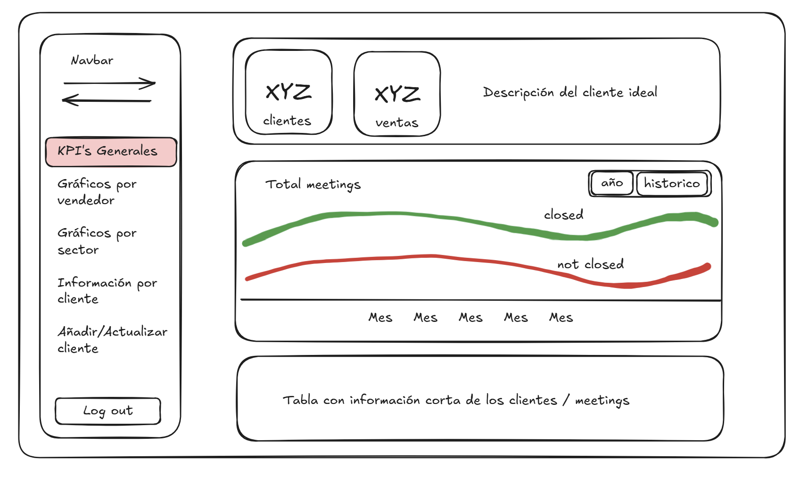

# Vambe AI Dashboard


A modern dashboard application built with Next.js for sales analytics and lead management. This dashboard provides comprehensive insights into sales performance, lead analysis, and meeting management with an intuitive user interface. Is connected with an AI powered backend that handles everything so you don't have to.

## Features

- 🔐 **Authentication System**: Login and Register functionality
- 📊 **4 Comprehensive Dashboards**:
  - General Dashboard with KPI cards and meeting analytics
  - Leads Analysis with source tracking and commercial sector insights
  - Salesmen Performance with individual metrics and success ratios
  - Meetings Management with AI classification
- 🤖 **AI-Powered Classification**: Automatic meeting classification by backend connected with AI
- 📝 **Meeting Management**: Add new meeting info and translations manually or via CSV upload
- 📁 **CSV Upload System**: Bulk meeting import with automatic processing, error detection, duplicate handling, and new salesperson registration
- 🌓 **Dark/Light Mode**: Complete theme switching capability
- 📱 **Responsive Design**: Mobile-friendly interface
- 🎨 **Customizable Layout**: Settings panel for personalization
- 🔍 **Search & Navigation**: Searchbar and collapsible sidebar

## Based On

This project was created based on the original dashboard template from [next-shadcn-admin-dashboard](https://github.com/arhamkhnz/next-shadcn-admin-dashboard).

## Prerequisites

Before running this application locally, make sure you have the following installed:

- **Node.js** (version 18 or higher)
- **npm** (comes with Node.js)

## Getting Started

1. **Clone the repository**
   ```bash
   git clone https://github.com/dvaldesg/frontend-vambe
   cd frontend-vambe
   ```

2. **Install dependencies**
   ```bash
   npm install
   ```

3. **Set up environment variables**
   ```bash
   cp .env.local.example .env.local
   ```
   Edit the `.env.local` file with your backend API configuration.
   
   **Recommended**: Use the local backend for development, which runs on `localhost:3333`. You can download and set up the backend from the repository: [backend-vambe](https://github.com/dvaldesg/backend-vambe)


4. **Run the development server**
   ```bash
   npm run dev
   ```

5. **Open your browser**
   Navigate to [http://localhost:3000](http://localhost:3000) to see the application.

## Dashboard Features

### General Dashboard
- **KPI Cards**: Four key performance indicator cards displaying total values with month-over-month comparison indicators: Total Meetings, Total Closings, Closing Rate, and Average Closings per Month. Each card shows this month's performance compared to the previous month.
- **Meeting Analytics**: Cumulative meetings chart organized by week, showing closed versus not closed meetings with flexible filtering options: All Time, Last 90 Days, and Last 30 Days. The timeline displays data from the most recent meeting backwards, rather than from today.
- **Meetings Table**: Comprehensive meeting information table featuring:
  - Frontend pagination for easy navigation
  - Column sorting capabilities
  - Column visibility toggle for customized views
  - Clickable client/meeting names that reveal detailed descriptions

### Leads Analysis Dashboard
- **Recent Leads**: Shows leads from the last 6 weeks based on the newest record (closed vs not closed)
- **Choice Reasons**: Bar chart displaying why customers choose Vambe
- **Lead Sources**: Ring chart showing lead origin distribution
- **Commercial Sectors**: Ring chart showing business sector breakdown
- **Full Reports**: Detailed success rate, closures, and failures by lead source and commercial sector

### Salesmen Dashboard
- **Salesman List**: Interactive list with selection/deselection capabilities, adding the selection to the performance chart
- **Performance Chart**: Line chart showing meetings and closures over time
- **Multi-comparison**: View multiple salesmen simultaneously, all by default
- **Cumulative View**: Toggle to see cumulative progress over time
- **Individual Reports**: Click salesman external link button to view success ratio by commercial sector

### Meetings Dashboard
- **Client Meetings List**: Filterable and searchable meeting records
- **AI Classification**: Detailed AI-powered client classification information
- **Meeting Details**: Comprehensive meeting information display
- **Manual Meeting Entry**: Add new meetings manually with automatic AI classification by the backend
- **CSV Upload**: Bulk import meetings via CSV files with comprehensive backend processing:
  - Automatic AI classification of all imported meetings
  - Error detection and reporting for invalid data
  - Duplicate meeting identification and handling
  - Automatic registration of new salespeople not previously in the system
  - Detailed import results with success/error counts

## Authentication & User Management

- **Token Management**: Backend provides 1-hour tokens (logout by context on session end)
- **Email Validation**: Login and register only validate email format in the backend
- **User Roles**: Admin and User roles available (currently all users created with User role)
- **Role Implementation**: No functional difference between roles implemented yet

## UI/UX Features

- **Layout Settings**: Customizable interface options
- **Theme Toggle**: Switch between light and dark modes
- **Profile Management**: View profile information and logout
- **Search Functionality**: Global search capability similar to sidebar
- **Sidebar Navigation**: Collapsible sidebar for better space management

## Tech Stack

- **Framework**: Next.js 15.4.2 with App Router
- **Language**: TypeScript 5.8.3
- **Styling**: Tailwind CSS 4.1.5
- **Components**: Shadcn/ui component library
- **State Management**: Zustand 5.0.6
- **Data Fetching**: TanStack React Query 5.83.0
- **Tables**: TanStack React Table 8.21.3
- **Authentication**: Custom JWT implementation
- **Charts**: Recharts 2.15.4 for data visualization
- **Forms**: React Hook Form 7.60.0 with Zod 3.25.76 validation
- **HTTP Client**: Axios 1.10.0
- **Drag & Drop**: DND Kit 6.3.1

## Development

The page auto-updates as you edit files. Start by modifying components in the `src/` directory.

## Learn More

To learn more about the technologies used:

- [Next.js Documentation](https://nextjs.org/docs)
- [Shadcn/ui Documentation](https://ui.shadcn.com/)
- [Tailwind CSS Documentation](https://tailwindcss.com/docs)

## Screenshots

Here are some screenshots from the creative process and dashboard views:

### General Dashboard


### Salesmen Dashboard


### Salesmen Performance Analysis


### Commercial Sectors Analysis


## Future Improvements

Things I would have liked to add or implement:

1. **Refresh Token Implementation**: Implement a refresh token system to make sessions more durable and secure, extending beyond the current 1-hour token limitation.

2. **Role-Based Access Control**: Add proper role restrictions so that only Admin users can create meetings/records and upload CSV files, taking advantage of the role information already available in the JWT token.

3. **Ideal Client Analysis**: Add a backend call to analyze and display the characteristics of an ideal client based on current data, including individual ideal client profiles for each salesman.

4. **Client Pain Points Map**: Create a visual pain points map showing what clients want to solve with Vambe, with intensity represented by radius based on metrics like number of required attention points, opportunity volume, delay importance, commercial sector, and other relevant factors.

5. **Enhanced User Profile**: Leverage user endpoints to make the profile section more meaningful and functional, displaying relevant user information and preferences.

6. **AI Classification Regeneration**: Add an endpoint to regenerate AI classification when necessary, allowing users to add extra insights or context that could improve the classification accuracy. 

